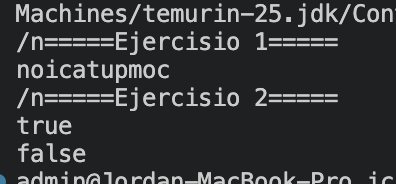

# Práctica: Estructuras Dinámicas Lineales

## Datos del Estudiante
- **Nombre:** Jorda Sagbay
- **Curso:** grupo 3 
- **Fecha:** 09/0/2026

---

## 1. Implementación de estructuras dinámicas lineales

**Fecha:** 09/06/2026

**Descripción:**

Creamos unh metodo para invertir la palabra computacion = noicatupmoc




### Captura del código de implementación del ejercicio 1

```java
public class Ejercisio1 {
     public String inveString(String texto){
        ArrayDeque<Character> pila = new ArrayDeque<>();
        for (char letra : texto.toCharArray()) 
            pila.push(letra);
            String invertido = "";
            while(!pila.isEmpty()){
                invertido+=pila.pop();

            }
        
        return invertido;
    }  
}
```


## 2. Ejercicio Palíndromo

**Fecha:** 09/06/2026
**Descripción:**
creamos un metodo para saber si una palabra es palindromo usando pilas 
.......

### Método implementado

```java
public boolean esPalindromo(String texto) {
    Stack<Character> pila = new Stack<>();

        
        for (int i = 0; i < texto.length(); i++) {
            pila.push(texto.charAt(i));
        }

        
        String textoInvertido = "";
        while (!pila.isEmpty()) {
            textoInvertido += pila.pop();
        }

       
        return texto.equals(textoInvertido);
        }
    }
```
    


